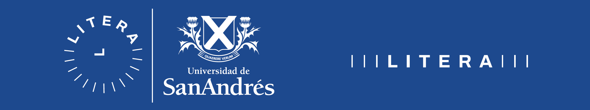

<a href="https://spiousas.github.io/DigitalRhythmsProject">Read in English</a> 🇺🇸 

 

# El Proyecto 'Ritmos Digitales'

El proyecto que estamos llevando adelante busca estudiar cómo nuestros ritmos diarios de actividad se ven reflejados en los dispositivos electrónicos que utilizamos. Creemos que las "huellas digitales" que vamos dejando atrás durante nuestras interacciones con la tecnología a diario pueden proveernos de información valiosa para estudiar nuestro hábitos diarios y sus cambios durante situaciones particulares.

**Por favor, considere brindarnos un poco de su tiempo para colaborar con nuestro proyecto. Siga las instrucciones a continuación para compartir sus datos para nuestra investigación.**

Como agradecimiento por su tiempo y esfuerzo, al final le ofreceremos una herramienta online que le permitirá visualizar sus datos a través de gráficos informativos y aprender un poco más sobre sí mismo. Encontrará esta herramienta enlazada al final de este instructivo.

## Cómo ayudarnos con sus datos

En este momento nos interesa recolectar datos de uso de aplicaciones en teléfonos Android; específicamente, sobre las horas en las cuales las aplicaciones están, o no, en uso. Prácticamente cualquiera que utilice un teléfono Android puede contribuir. Si bien por el momento no podemos utilizar datos de teléfonos iPhone, no dude en compartir este estudio con los usuarios de Android que conozca.
No dude en compartir sus datos incluso si cree que no usa mucho su teléfono. ¡Se sorprendería al saber cuán valiosos son para nosotros!

Cuando esté listo para compartir sus datos, haga clic en el botón de abajo.

# Acerca de nuestro laboratorio y métodos de contacto

El Laboratorio Interdisciplinario del Tiempo y la Experiencia de la Universidad de San Andrés se enfoca en el estudio de los ritmos biológicos y la cronobiología humana en sus distintos niveles de análisis. Uno de nuestros intereses principales es el estudio del sueño en seres humanos en la vida real, particularmente en los que llamaríamos "condiciones poco convencionales": durante una cuarentena en medio de una pandemia, en comunidades que viven en aislamiento sin acceso a luz eléctrica, en personas en situación de calle, entre otras.
Por favor, siéntase libre de contactarnos con preguntas o sugerencias.

Por favor, siéntase libre de contactarnos con preguntas o sugerencias.

### Coordinadores:

**Leandro Casiraghi**, Laboratorio Interdisciplinario del Tiempo y la Experiencia (LITERA), Universidad de San Andrés.
Correo electrónico: <a href="mailto:lcasiraghi@udesa.edu.ar">lcasiraghi@udesa.edu.ar</a>

**Ignacio Spiousas**, Laboratorio Interdisciplinario del Tiempo y la Experiencia (LITERA), Universidad de San Andrés.
correo electrónico: <a href="mailto:lspiousas@udesa.edu.ar">lspiousas@udesa.edu.ar</a>

### Investigador principal:

**Horacio de la Iglesia**, Department of Biology, University of Washington, +1(206) 616-4697,
correo electrónico: <a href="mailto:horaciod@uw.edu">horaciod@uw.edu</a>
